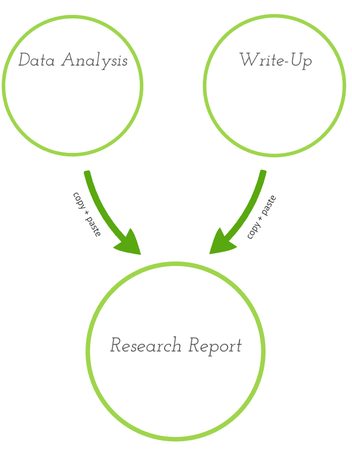

<style>
  .col2 {
    columns: 2 200px;         /* number of columns and width in pixels*/
    -webkit-columns: 2 200px; /* chrome, safari */
    -moz-columns: 2 200px;    /* firefox */
  }
  .col3 {
    columns: 3 100px;
    -webkit-columns: 3 100px;
    -moz-columns: 3 100px;
  }
</style>


```{r setup, include = FALSE}
knitr::opts_chunk$set(echo = FALSE)
library(dplyr)
library(tidyr)
library(ggplot2)
library(plm)
library(dygraphs)
library(xts)
library(plotly)
```

## Acknowledgments 
I stole a lot of this work wholesale from people who know more than I do. I thank them and ask their forgiveness.  

- Andrew Bray see [Reproducibility 2.0](https://prezi.com/rtmytpb6iwsw/reproducible-20/)
- Nick Horton
- Mine &Ccedil;etinkaya-Rundel
- Hadley Wickham 
- Danny Kaplan 
- Amelia McNamara 
- Ben Baumer
- Cosma Shalizi


## R Markdown & Reproducibility 

- What happens in a traditional research report? 
- Are traditional research reports easily reproducible? 
- What gives us *soup to nuts* reproducibility? 
  - Answer: R Markdown or Scripted LaTeX + STATA
- Works within the TIER framework
- I've implemented a variation of this in an upper-level economics elective

##Questions on your notecard
Please take a couple of minutes to write down a question you have about R Markdown and Reproducibility. 

Think about the following ideas: 

1. What *problem* could R Markdown (and R Studio) solve for me? 
2. What is something I'm *accustomed to doing* that I would want R Markdown (and R Studio) to do for me? 
3. What is an *expectation* I have about what I want Simon to cover? 

Just take a moment to write down something along these lines for now and put aside your notecard. 


## Traditional Reports

<div class="col2">
```{r, out.width = "400px", fig.cap = "Courtesy of Bray, 2016"}

```

The Good 

- familiar format, e.g. Word 
- easy learning curve

The Bad

- tough for reproducibility
- difficult to update
- mistakes crop up
- teams can't collaborate easily

The Ugly? 

- Word/GDocs = Ugly?

</div>

## R Markdown Report/Notebook? 
<div class="col2"> 
```{r, out.width = "400px", fig.cap = "Courtesy of Bray, 2016"}
knitr::include_graphics("figures/rmd_struct.png")
```


The good

- easy to reproduce
- easy to edit/update 
- easy to collaborate
- standardized & fast

The bad

- students must learn syntax
- error-free to compile

The ugly? 

- inequality in student backgrounds

</div>


##Text Formatting

    
    # Header 1

    ## Header 2

    ### Header 3

    This is normal sized text used in the body of our work. 

    For bullet points, we use dashes, e.g. 

    - Intro to RStudio
    - More content
      - a sub-point
    - Back to the original level
    

## Document Types

R Markdown can produce a variety of document types (other than the default `html`):

*   `pdf_document` makes a PDF with LaTeX (`.pdf`)
  
*   `word_document` for Microsoft Word documents (`.docx`).
  
*   `odt_document` for OpenDocument Text documents (`.odt`).
  
*   `rtf_document` for Rich Text Format documents (`.rtf`) 
  
And others. 

## Data work
Think about data analysis as falling into three loose categories: 

- management & wrangling
- visualization & summary statistics
- modeling & inference

All of this occurs in the code "chunk"

##Code chunks

- To open a code chunk hit CMD + OPTION + I on a Mac  

- Or type out three backticks ``` folowed by {r} 

- And then three more back ticks ``` on another line. 

- Within the {r} you can specify options, like {eval = FALSE} if you don't want it to evaluate the code

- Or you can label the code chunk, e.g. {r cars} labels the chunk "cars" in your ToC

## Code Chunk: Example 
<pre class="markdown"><code>&#96;&#96;&#96;{r cars, echo = TRUE}
summary(cars)
&#96;&#96;&#96;
</code></pre>

The option `echo = TRUE` means that the code gets included in the rendered html. 

```{r cars, echo = TRUE}
summary(cars)
```


## Slide with Plot (Reproduction of Sutter, 2009)

```{r Sutter Data, echo = FALSE}
SutExp <- read.csv("sutterexperiment.csv")
SutExp <- 
  SutExp %>% 
  rename(session = Session, subject = Subject, r1 = R1, r2 = R2, r3 = R3, r4 = R4, r5 = R5, r6 = R6, r7 = R7, r8 = R8, r9 = R9, treatment = Treatment)

```

```{r summary data, echo = FALSE}
groupAves <- 
  SutExp %>% 
  group_by(treatment) %>%
  summarise(r1 = mean(r1), r2 = mean(r2), r3 = mean(r3), r4 = mean(r4), r5 = mean(r5), r6 = mean(r6), r7 = mean(r7), r8 = mean(r8), r9 = mean(r9))
```

```{r narrow data}
narrowAve <- 
  groupAves %>%
  gather(round, average, r1:r9)
```


```{r plot1}
Plot1 <- 
  narrowAve %>%
  filter(treatment == "individual" | treatment == "teamtreat" ) %>%
  group_by(treatment) %>%
  arrange(treatment)
Plot1 %>%
  ggplot(aes(x = round, y = average, color = treatment)) + 
  geom_point(aes(shape = treatment)) +
  geom_line(aes(group = treatment)) + 
  ylim(20, 80) +
  xlab("Round") +
  ylab("Average amount allocated") + 
  scale_x_discrete(labels = seq(1, 9, by = 1)) +  
  scale_colour_discrete(name = "Treatment",
                         breaks = c("individual", "teamtreat"),
                         labels = c("Indidividuals", "Teams")) +
  scale_shape_discrete(name = "Treatment",
                         breaks = c("individual", "teamtreat"),
                         labels = c("Indidividuals", "Teams"))
```

##Dynamic Graphs 

```{r dygraph, message = FALSE, echo = FALSE}
library(xts)
library(dygraphs)
Participation <- read.csv("/Users/shalliday/Google Drive/website_backup/eco254/fall_2015/Labs/Lab2/more/labor_force_participation.csv")
Partdate <- as.Date(Participation$date)
MaleP <- xts(Participation$male, Partdate)
FemaleP <- xts(Participation$female, Partdate)
LFPR <- cbind(MaleP, FemaleP)
colnames(LFPR) <- c("Male", "Female")
dygraph(LFPR, main = "Labor Participation Rate Over Time") %>%
       dySeries("Male", label="Male")%>%
       dySeries("Female", label="Female")%>%
       dyAxis("x", label="Date")%>%
       dyAxis("y", label="Labor Force Participation")%>%
       dyHighlight(highlightSeriesOpts = list(strokeWidth = 3), 
                   highlightCircleSize = 4)%>%
       dyRangeSelector()
       #dyOptions(drawGrid = input$showgrid, 
                 #colors = RColorBrewer::brewer.pal(5, "Set2"))
```


##Plotly Graphs


```{r ancona, echo = FALSE}
AnconaBase <- read.csv("/Users/shalliday/Google Drive/github/bfh-textbook/indmarketdemand/ancona.csv")
Ancona <- 
  AnconaBase %>%
  rename(date = dTransDataVendita, 
         productid = iProdID, 
         productdescription = vchClasseProdottoDescrizione, 
         speciesname = vchSpecieDescrizione, 
         quantity = nTransQuantita, 
         unitprice = nTransPrezzoUnitario, 
         saleprice = nTransPrezzoVendita, 
         finalprice = nTransPrezzoFinale, 
         producerid = iProduttoreID, 
         qualityid = iQualitaID, 
         qualitydescription = vchQualitaDescrizione,
         caseid = nNumCasse)
AnconaAve <- 
  Ancona %>% 
  group_by(date) %>%
  summarise(price = round(mean(unitprice), 2), 
            meanquantity = mean(quantity), 
            quantity = round(sum(quantity), 2))
```

```{r plotly Ancona}
AnconaPlot <- 
  AnconaAve %>% 
  ggplot(aes(x = price, y = quantity)) +
  geom_point() +
  geom_smooth(formula = y ~ x, se = FALSE, method = "lm") +
  xlab("Daily average price per kilogram (Euros)") +
  ylab("Daily quantity (kilograms)") +
  coord_flip() +  
  theme_bw() + 
  theme(axis.title = element_text(size = 16))
ggplotly(AnconaPlot)
```


##Alter and check some data
```{r create uniqid}
SutExpUniq <- 
  SutExp %>% 
  mutate(uniqid = paste(session, treatment, subject, sep = "_"))
head(SutExpUniq)
```

## Statistical Tests

```{r}
SutNarrow <- 
  SutExpUniq %>%
  gather(round, value, r1:r9) %>%
  arrange(session, subject, treatment, team)
Plot1data <- 
  SutNarrow %>%
  filter(treatment == "individual" | treatment == "teamtreat" )
wilcox.test(value ~ treatment, data = Plot1data)
```


## Regression output 

```{r}
m1 <- lm(value ~ treatment, data = SutNarrow)
summary(m1)
```

##Or a Panel Regression
```{r}
m3 <- plm(value ~ treatment, data = SutNarrow, index = c("uniqid"), model = "random", effect = "time")
summary(m3)
```


##Math? 
How about Bayes' Rule? 

$$Pr(\mbox{Outcome} | \mbox{signal}) = \frac{\theta p}{\theta p - (1 - \theta)(1 - p)}$$

R Markdown uses $\LaTeX$ for math and it immediately gets displayed in R Studio.  

That is, $\LaTeX$ without the challenges of learning the packages, tables, etc that makes learning $\LaTeX$ so hard.

In-line equations are bracketed by single dollar signs `$`. 

Off-set equations are bracketed by double dollar signs `$$`. 


##What else? 
R Markdown and R Studio together have excellent capabilities. 

- R Studio can show you the output of the commands *within* the R Markdown file
- R Studio has *error-detection* and *debugging* assistance for your code (unlike, e.g. STATA or aspects of Excel)
- R Studio server can be hosted online and your students work with logins there

##R Link Love? 
New to R? 

- Check out the Computation and Visualization Consortium's week-long [workshop](https://www.macalester.edu/hhmi/curricularinnovation/cvc/) over the summer (dates TBC - Kaplan, Prium & Horton)
- Consider subscribing to classes at [Datacamp.com](www.datacamp.com) (take the intro free of charge)
- Grolemund & Wickham, 2016, *R for Data Science*, [r4ds](r4ds.had.co.nz)
- Baumer, Horton & Kaplan, forthcoming, [*Modern Data Science with R*](https://www.crcpress.com/Modern-Data-Science-with-R/Baumer-Kaplan-Horton/p/book/9781498724487). 

##Notecards again... 

- Go back to your notecards
- Re-read them 
- Did I cover what you wanted me to cover? 
- Do you have *other* or *new* concerns or questions? (write them on the back)
- Chat to someone next to you about what you're thinking about. 
- Share with the workshop. 
- Yes, you're doing Think-Pair-Share...

